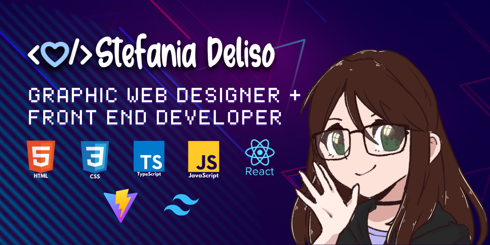

    <ul>
      <li>🎓 I have a certificate in front-end development from the Steve Jobs Academy.</li>
      <li>📚 I'm currently studying on Google Cloud's courses.</li>
      <li>🌱 I'm on track for learning more about Frameworks, Web technologies, Cloud Computing and a little bit of Security.</li>
      <li>✨ I'm currently working on my portfolio</li>
      <li>🤫 My newest side project is currently still in stealth mode...</li>
      <li>📫 How to reach me: 
 
  
  
  
  

</li>
    </li>
    </ul>
 

  <h2>Tech Stack </h2>
  
Here are the technologies and tools I use regularly:

  

    
    
    
    
    
    
    
    
    
    
    
    
    
    
    
    
    
    
    
    
    
    
    
  

  <h2>Dev & Design Tools</h2>

Here are the tools I use for development and design:

 

  <h3>Operating System: </h3>

  <h3>GitHub Analytics ⚙️</h3>
  

    
    
    
  

